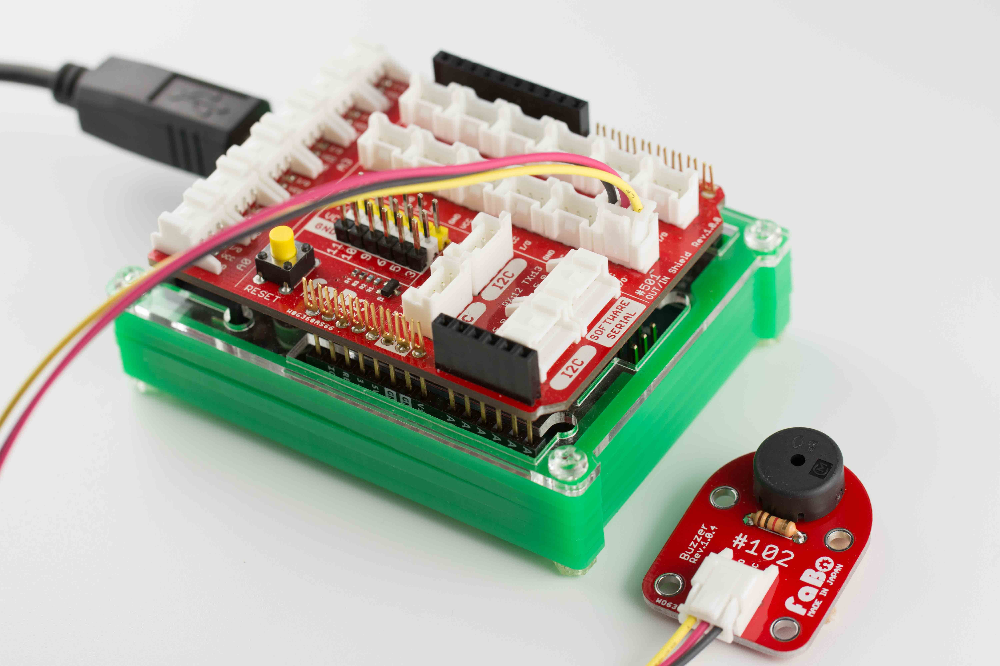

# #102 Buzzer Brick

[](../img/100_analog/product/102.jpg)
<!--COLORME-->

圧電ブザーを使ったBrickです。I/Oピンより、鳴らす音や音の長さを制御することができます。

## 接続
アナログコネクタ(A0〜A5)、またはデジタルコネクタ(2〜13)のいずれかに接続します。



## ソースコード
D2コネクタにBuzzer Brickを接続し、ビープ音を鳴らしています。

```c
//
// FaBo Brick Sample
//
// #102 Buzzer Brick
//

#define buzzerPin 2 // ブザーピンの設定

int duration = 500; // 音を鳴らす時間

void setup() {
  // ブザーピンを出力用に設定
  pinMode(buzzerPin,OUTPUT);
}

void loop() {
  tone(buzzerPin,262,duration); // ド
  delay(duration);

  tone(buzzerPin,294,duration); // レ
  delay(duration);

  tone(buzzerPin,330,duration); // ミ
  delay(duration);

  delay(1000);
}
```

tone関数にて出力できる音階と周波数は下記のようになります。
<br>
数値が大きくなるほど音が高くなります。

| | ド | ド♯ | レ | レ♯ | ミ | ファ | ファ♯ | ソ | ソ♯ | ラ | ラ♯ | シ |
|  -- | -- |-- | -- | -- | -- | -- | -- | -- | -- | -- | -- | -- |
|  1 | 131 | 139 | 147 | 156 | 165 | 175 | 185 | 196 | 208 | 220 | 233 | 247 |
| 2 | 262 | 277 | 294 | 311 | 330 | 349 | 370 | 392 | 415 | 440 | 466 | 494 |
 | 3 | 523 | 554 | 587 | 622 | 659 | 698 | 740 | 784 | 831 | 880 | 932 | 988 |

その他の音階については下記をご参照下さい。

[https://www.arduino.cc/en/Tutorial/ToneMelody?from=Tutorial.Tone](https://www.arduino.cc/en/Tutorial/ToneMelody?from=Tutorial.Tone)

## 構成Parts
- 圧電ブザー

## 回路図


## GitHub
- [https://github.com/FaBoPlatform/FaBo/tree/master/102_buzzer](https://github.com/FaBoPlatform/FaBo/tree/master/102_buzzer)
