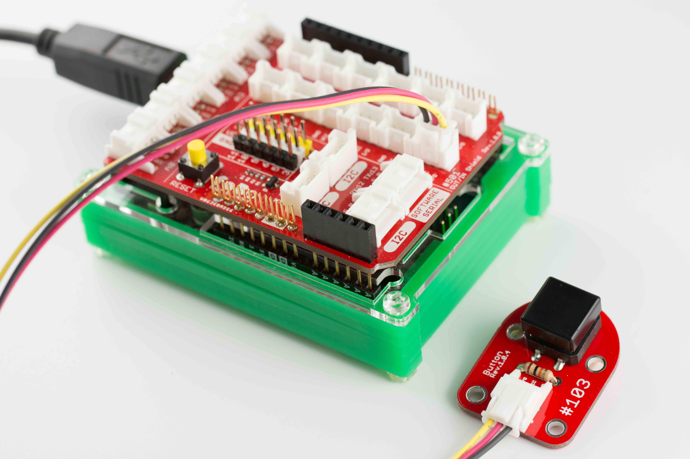
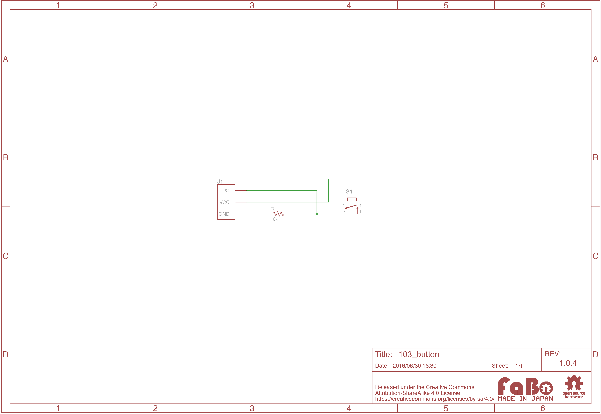

# #103 Button Brick

[](../img/100_analog/product/103.jpg)

ボタンを使ったBrickです。I/OピンよりボタンのON/OFFの状態を取得することができます。

※ボタンカバー部分の色はランダムで送付するため色のご指定はできません。あらかじめご了承ください。

## 接続
アナログコネクタ(A0〜A5)、またはデジタルコネクタ(2〜13)のいずれかに接続します。


## サンプルコード

A0コネクタに接続したButton Brickの入力により、D2コネクタに接続したLED Brick の点灯/消灯を制御しています。
```c
#define buttonPin A0 // ボタンピン
#define ledPin 2     // LEDピン

void setup() {
  // ボタンピンを入力用に設定
  pinMode(buttonPin, INPUT);
  // LEDピンを出力用に設定
  pinMode(ledPin, OUTPUT);
}

void loop(){
  // ボタンの押下状況を取得
  int buttonState  = digitalRead(buttonPin);

  // ボタン押下判定
  if (buttonState == HIGH) {
    // ボタンが押された場合、LED点灯
    digitalWrite(ledPin, HIGH);
  }
  else {
    // LED消灯
    digitalWrite(ledPin, LOW);
  }
}
```


## 回路図


## 構成Parts
- 12mm角タクトスイッチ

## GitHub
- [https://github.com/FaBoPlatform/FaBo/tree/master/103_button](https://github.com/FaBoPlatform/FaBo/tree/master/103_button)
