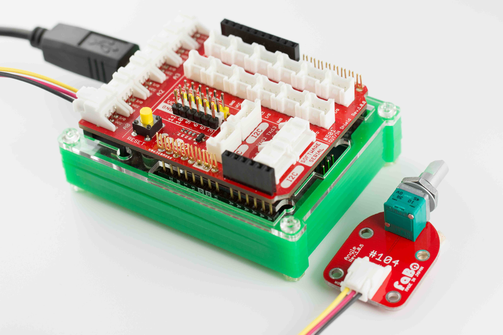
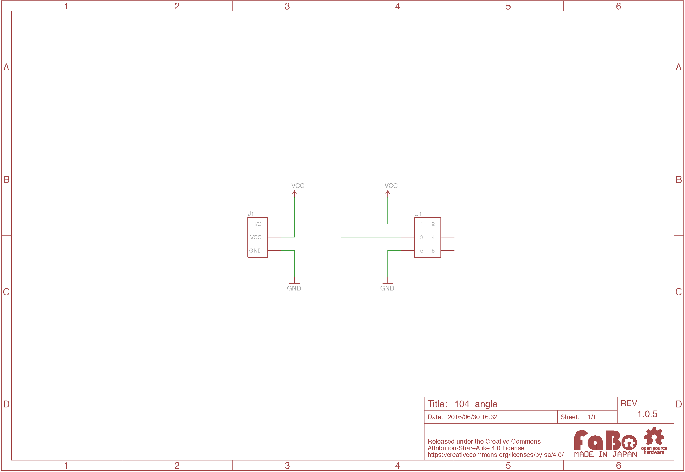

# #104 Angle Brick

[](../img/100_analog/product/104.jpg)

ボリューム抵抗を使ったBrickです。

I/Oピンからアナログ値を取得することができます。

LED Brickの明るさを調節する際などに使用します。

## 接続

アナログコネクタ(A0〜A5)のいずれかに接続します。



## ソースコード

A0コネクタにAngleを接続して、D3コネクタに接続したLED Brickの明るさ調節に使用しています。
LED Birckの色の明るさを変えるには、PWMの端子につなぐ必要があり、今回はD3に接続しています。

なお、FaBo Outin ShieldのPWM対応端子は　

* D3
* D5
* D6
* D9
* D10
* D11

になっています。(Arduinoと同じ)

```c
#define anglePin A0 // Angleピン
#define ledPin 3    // LEDピン

void setup() {
  // Angleピンを入力用に設定
  pinMode(anglePin, INPUT);
  // LEDピンを出力用に設定
  pinMode(ledPin, OUTPUT);
}

void loop() {
  // Angleから値を取得(0〜1023)
  int angleValue = analogRead(anglePin);
  // analogWrite用に取得した値を変換
  int outputValue = map(angleValue, 0, 1023, 0, 255);
  // PWMによりLED点灯
  analogWrite(ledPin, outputValue);
}
```

## 回路図


## 構成Parts
- ボリューム抵抗器A 10k

## GitHub
- [https://github.com/FaBoPlatform/FaBo/tree/master/104_angle](https://github.com/FaBoPlatform/FaBo/tree/master/104_angle)
