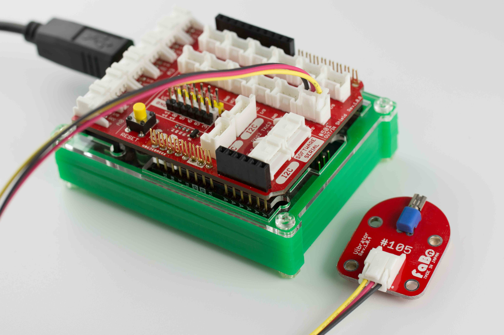
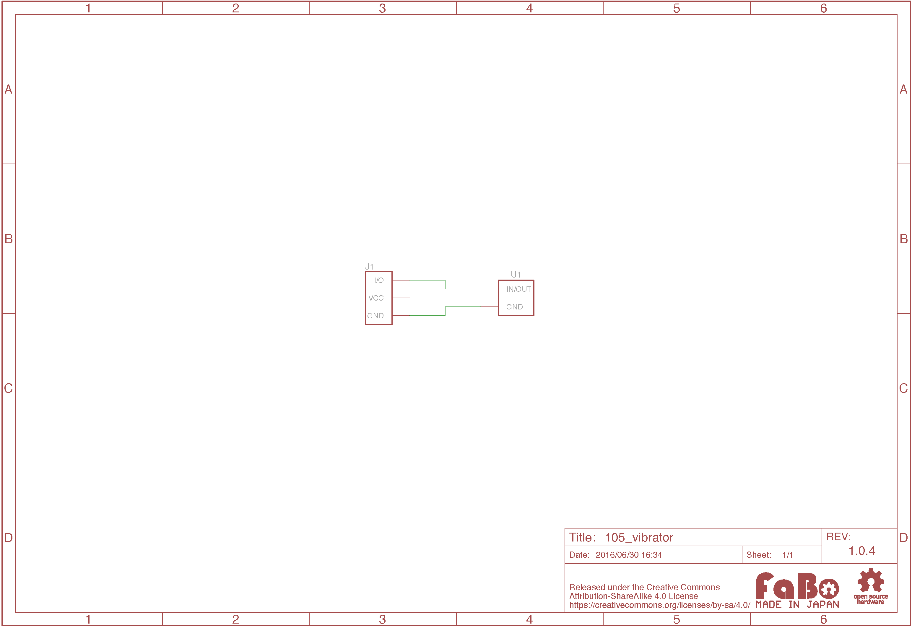

# #105 Vibrator Brick

(../img/100_analog/product/105.jpg)

振動モーターを使用したBrickです。

I/Oピンから振動モーターのON/OFFを制御することができます。

## 接続

アナログコネクタ(A0〜A5)、またはデジタルコネクタ(2〜13)のいずれかに接続します。



## パーツ仕様

| Document |
|:--|
| [LA3R5-480AH1](http://akizukidenshi.com/catalog/g/gP-06744/) |


## ソースコード

A0コネクタに接続したButton Brickの入力により、D2コネクタに接続したVibrator Brick のON/OFFを制御しています。

```c
//
// FaBo Brick Sample
//
// #105 Vibrator Brick
//

#define vibratorPin 2 // Vibratorピン
#define buttonPin A0  // ボタンピン

void setup() {
  // Vibratorピンを出力用に設定
  pinMode(vibratorPin, OUTPUT);
  // ボタンピンを入力用に設定
  pinMode(buttonPin, INPUT);
}

void loop(){
  // ボタンの押下状況を取得
  int buttonState = digitalRead(buttonPin);

  // ボタン押下判定
  if (buttonState == HIGH) {
    // ボタンが押された場合、Vibratorオン
    digitalWrite(vibratorPin, HIGH);
  }
  else {
    // Vibratorオフ
    digitalWrite(vibratorPin, LOW);
  }
}
```

## 構成Parts
- 振動モーター LA3R5-480AH1

## 回路図


## GitHub
- [https://github.com/FaBoPlatform/FaBo/tree/master/105_vibrator](https://github.com/FaBoPlatform/FaBo/tree/master/105_vibrator)
