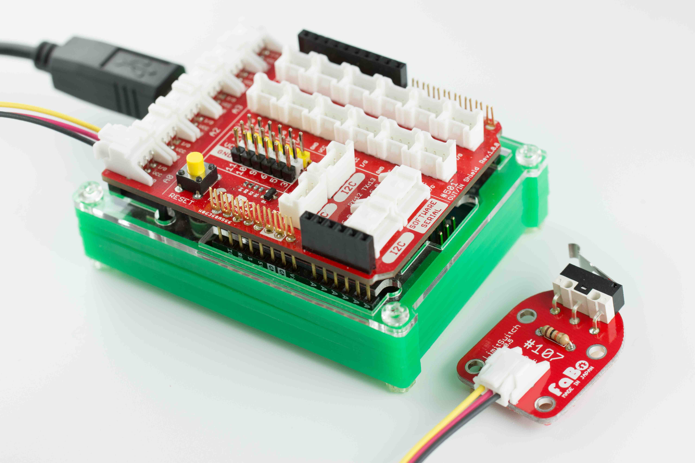
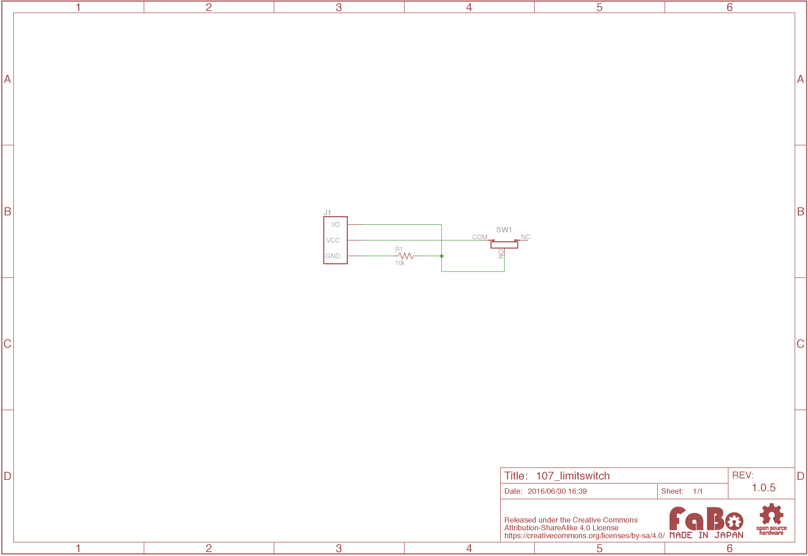

# #107 LimitSwitch Brick


<!--COLORME-->

## Overview
リミットスイッチを使ったBrickです。

I/OピンよりスイッチのON/OFFの状態を取得することができます。

機械の自動停止や位置検出の際に使用します。

## 接続

### Arduino
アナログコネクタ(A0〜A5)、またはデジタルコネクタ(2〜13)のいずれかに接続します。



###Raspberry PI
GPIOコネクタのいずれかに接続します。

### IchigoJam
OUTコネクタのいずれかに接続します。


## Support
|Arduino|RaspberryPI|IchigoJam|
|:--:|:--:|:--:|
|◯|◯|◯|

## 回路図


## ソースコード
A0コネクタにLimitSwitch Brickを接続し、D2コネクタに接続したLED Brickの点灯/消灯を制御しています。

```c
#define buttonPin A0 // リミットスイッチピン
#define ledPin 2     // LEDピン

void setup() {
  // リミットスイッチピンを入力用に設定
  pinMode(buttonPin, INPUT);
  // LEDピンを出力用に設定
  pinMode(ledPin, OUTPUT);
}

void loop(){
  // リミットスイッチの押下状況を取得
  int buttonState = digitalRead(buttonPin);

  // リミットスイッチ判定
  if (buttonState == LOW) {
    // LED点灯
    digitalWrite(ledPin, HIGH);
  }
  else {
    // LED消灯
    digitalWrite(ledPin, LOW);
  }
}
```

## 構成Parts
- リミットスイッチ

## GitHub
- https://github.com/FaBoPlatform/FaBo/tree/master/107_limitswitch
