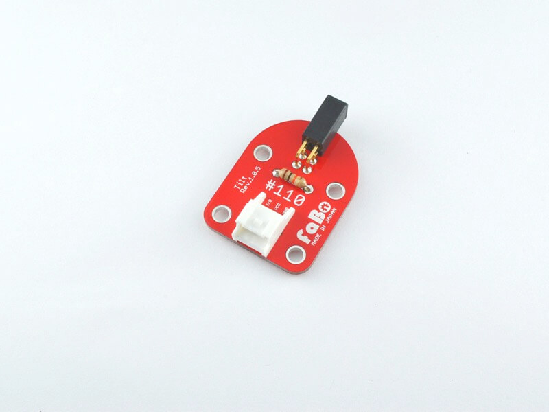
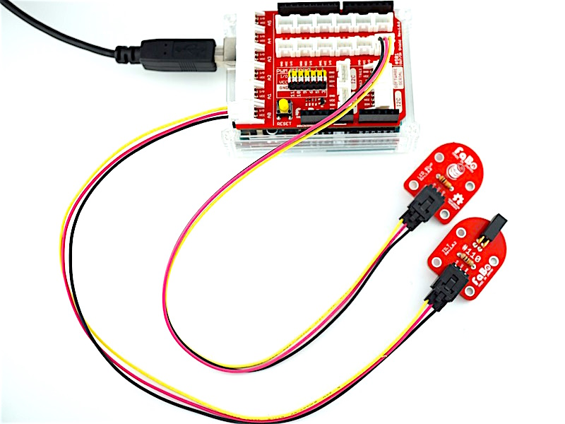
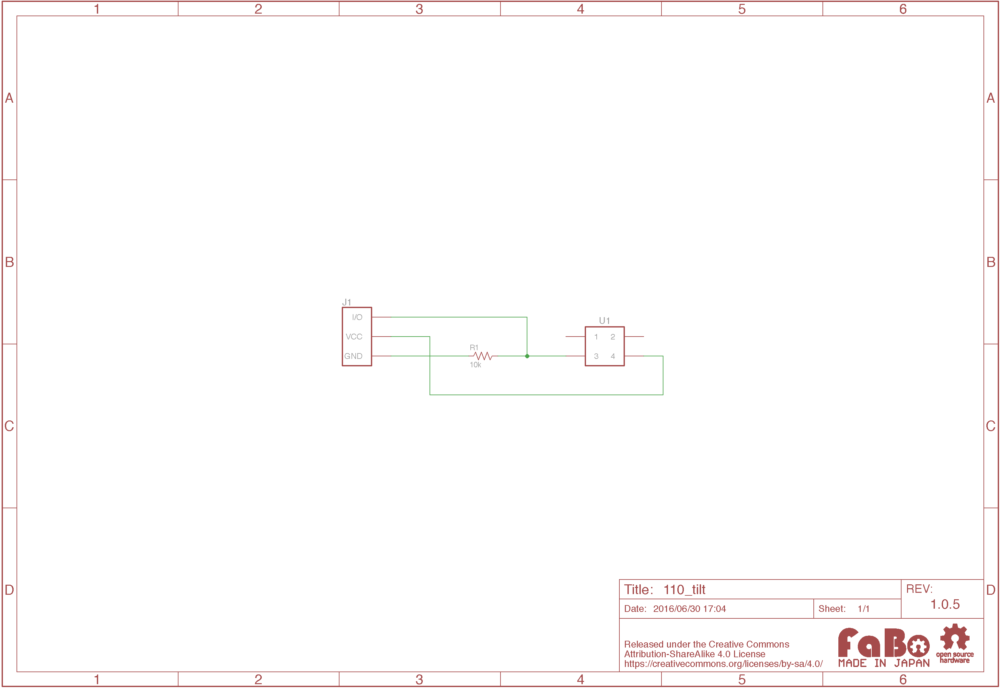

# #110 Tilt Brick


<!--COLORME-->

## Overview
傾斜センサーを使用したBrickです。

I/Oピンより傾斜センサーの状態をデジタル値(0〜1)取得することができます。

黒い部分の中に玉が入っていて傾くとデジタル値が変化します。

LED Brickを点灯/消灯させる際などに使用します。


## 接続
アナログコネクタ(A0〜A5)、またはデジタルコネクタ(2〜13)のいずれかに接続します。


## 回路図


## ソースコード

A0コネクタに接続したTilt Brickの傾きによって、D2コネクタに接続したLED Brickを点灯/消灯させています。

```c
#define buttonPin A0
#define ledPin 2

void setup() {
  pinMode(buttonPin, INPUT);
  pinMode(ledPin, OUTPUT);
}

void loop(){

  int buttonState = digitalRead(buttonPin);

  if (buttonState == HIGH) {
    digitalWrite(ledPin, HIGH);
  }
  else {
    digitalWrite(ledPin, LOW);
  }
}
```

## 構成Parts
- 傾斜(振動)スイッチ

## GitHub
- https://github.com/FaBoPlatform/FaBo/tree/master/110_tilt
