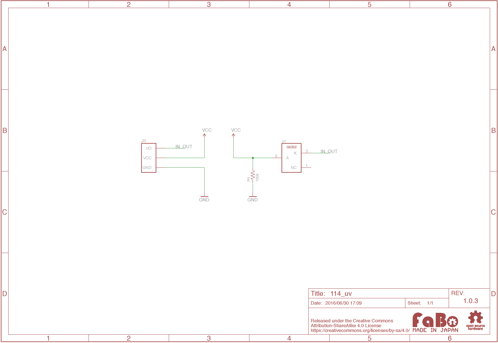

# #114 UV Brick


<!--COLORME-->

## Overview
紫外線センサーを使用したBrickです。I/Oピンより、紫外線の強弱をアナログ値(0〜1023)で取得することができます。

## 接続
アナログコネクタ(A0〜A5)のいずれかに接続します。

### IchigoJam
アナログ用コネクタ(IN2またはANA()で設定したコネクタ)のどれかに接続します。

## 回路図


## ソースコード
A0コネクタに接続し、紫外線の強弱をアナログ値で出力します。

```c
#define uvPin A0

void setup() {
  pinMode(uvPin,INPUT);
  Serial.begin(9600);
}

void loop() {
  int uvValue = analogRead(uvPin) ;
  Serial.println(uvValue) ;
  delay(10);
}
```

## 構成Parts
- GaAsPフォトダイオードG6262

## GitHub
- https://github.com/FaBoPlatform/FaBo/tree/master/114_uv
