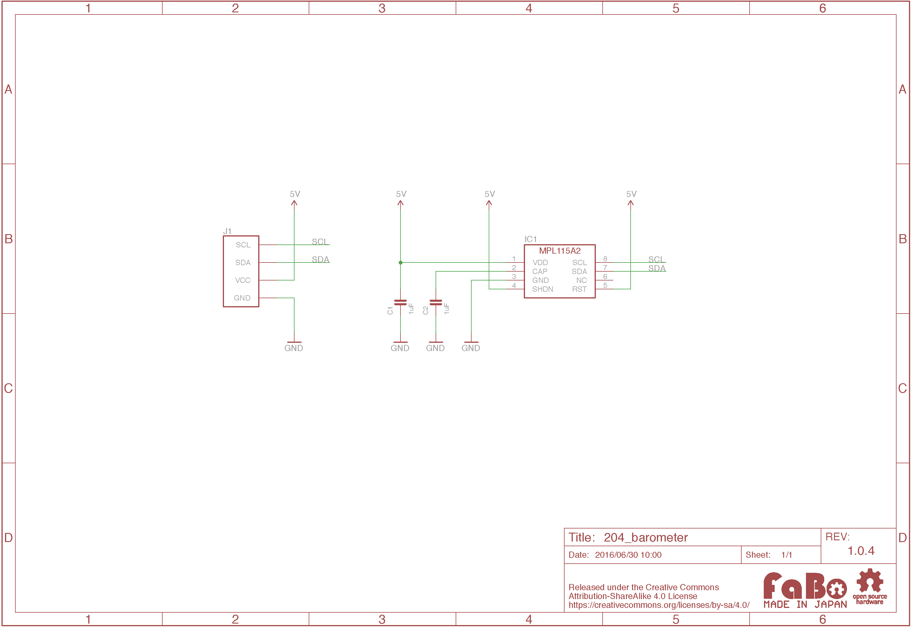

# #204 Barometer I2C Brick


<!--COLORME-->

## Overview
大気圧センサを使用したBrickです。

I2Cでデータを取得できます。

## 接続
I2Cコネクタへ接続します。


## MPL115A2 Datasheet
| Document |
| -- |
| [MPL115A2 Datasheet](http://cache.freescale.com/files/sensors/doc/data_sheet/MPL115A2.pdf) |

## Register
| Slave Address |
| -- |
| 0x60 |

## 回路図


## Library


  ライブラリ名：「FaBo 204 Baromter MPL115A2」

- [Library GitHub](https://github.com/FaBoPlatform/FaBoBarometer-MPL115-Library)
- [Library Document](http://fabo.io/doxygen/FaBoBarometer-MPL115-Library/)

## ソースコード
I2Cコネクタに接続したBarometer Brickより、気圧、温度、標高212mの気圧を取得し、シリアルモニタに出力します。

```c
/**
 @file barometer.ino
 @brief This is an Example for the FaBo Barometer I2C Brick.

   http://fabo.io/204.html

   Released under APACHE LICENSE, VERSION 2.0

   http://www.apache.org/licenses/

 @author FaBo<info@fabo.io>
*/

#include <Wire.h>
#include <FaBoBarometer_MPL115.h>

FaBoBarometer faboBarometer;

void setup() {
  Serial.begin(9600);
  Serial.println();
  Serial.println("RESET");
  faboBarometer.begin();
}

void loop() {
  // 温度を表示
  Serial.print("Temp: ");
  Serial.println(faboBarometer.readTemp());
  // 海面気圧を表示
  Serial.print("hPa: ");
  Serial.println(faboBarometer.readHpa());
  // readHpa()に標高を渡す
  Serial.print("hPa: ");
  // 会津若松市の標高:212.0m
  Serial.println(faboBarometer.readHpa(212.0));
  delay(1000);
}
```


## Parts
- Freescale(NXP) MPL115A2

## GitHub
- https://github.com/FaBoPlatform/FaBo/tree/master/204_barometer
