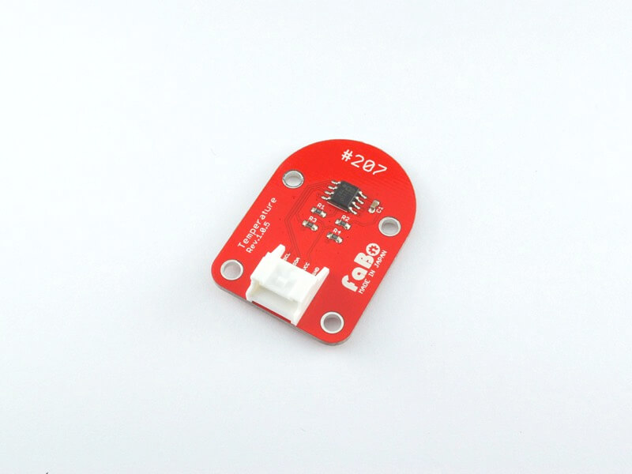
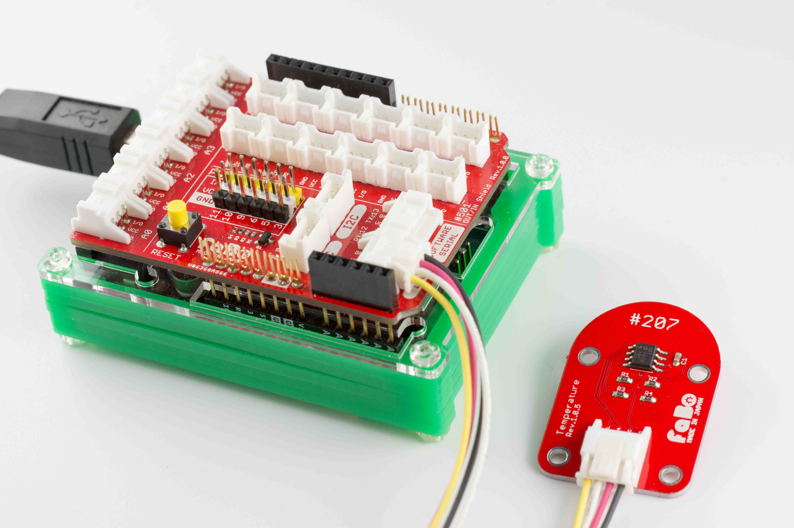
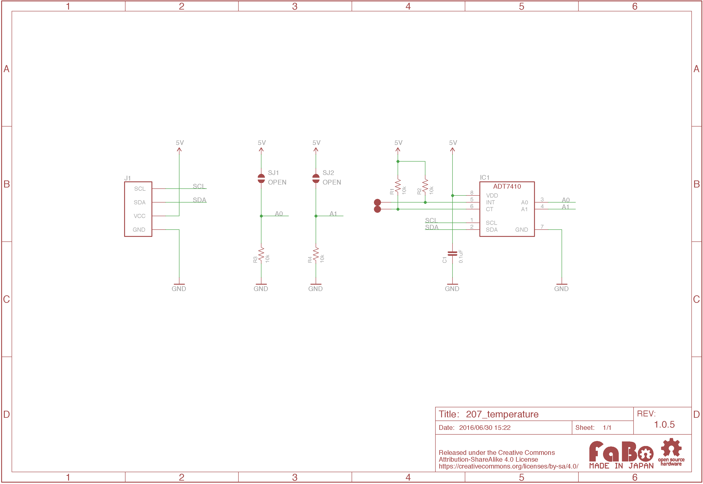
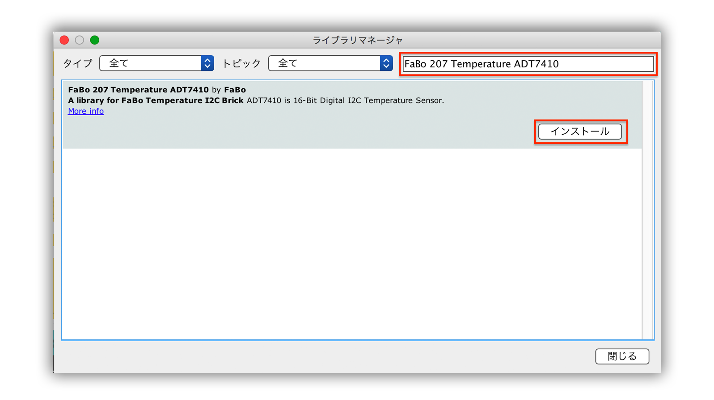

# #207 Temperature I2C Brick


<!--COLORME-->

## Overview
温度センサを使用したBrickです。
I2Cでデータを取得できます。

計測できる範囲は−55度〜150度です。

## 接続
I2Cコネクタへ接続します。



## ADT7410 Datasheet
| Document |
| -- |
| [ADT7410 Datasheet](http://www.analog.com/media/en/technical-documentation/data-sheets/ADT7410.pdf) |

## Register
| Slave Address |
| -- |
| 0x48 |

## 回路図


## Library




  ライブラリ名：「FaBo 207 Temperature ADT7410」

- [Library GitHub](https://github.com/FaBoPlatform/FaBoTemperature-ADT7410-Library)
- [Library Document](http://fabo.io/doxygen/FaBoTemperature-ADT7410-Library/)

## ソースコード
I2CコネクタにTemperature Brick(I2C)を接続し、取得した温度をシリアルモニタに出力します。

```c
/**
 @file temperature.ino
 @brief This is an Example for the FaBo Temperature I2C Brick.

   http://fabo.io/207.html

   Released under APACHE LICENSE, VERSION 2.0

   http://www.apache.org/licenses/

 @author FaBo<info@fabo.io>
*/

#include <Wire.h>
#include <FaBoTemperature_ADT7410.h>

FaBoTemperature faboTemperature;

void setup() {
  Serial.begin(9600);
  Serial.println("RESET");
  Serial.println();

  faboTemperature.begin();
}

void loop() {
  Serial.print("Temperarue: ");
  Serial.println(faboTemperature.readTemperature(),8);
  delay(1000);
}
```

## Parts
- Analog Devices ADT7410

## GitHub
- https://github.com/FaBoPlatform/FaBo/tree/master/207_temperature
