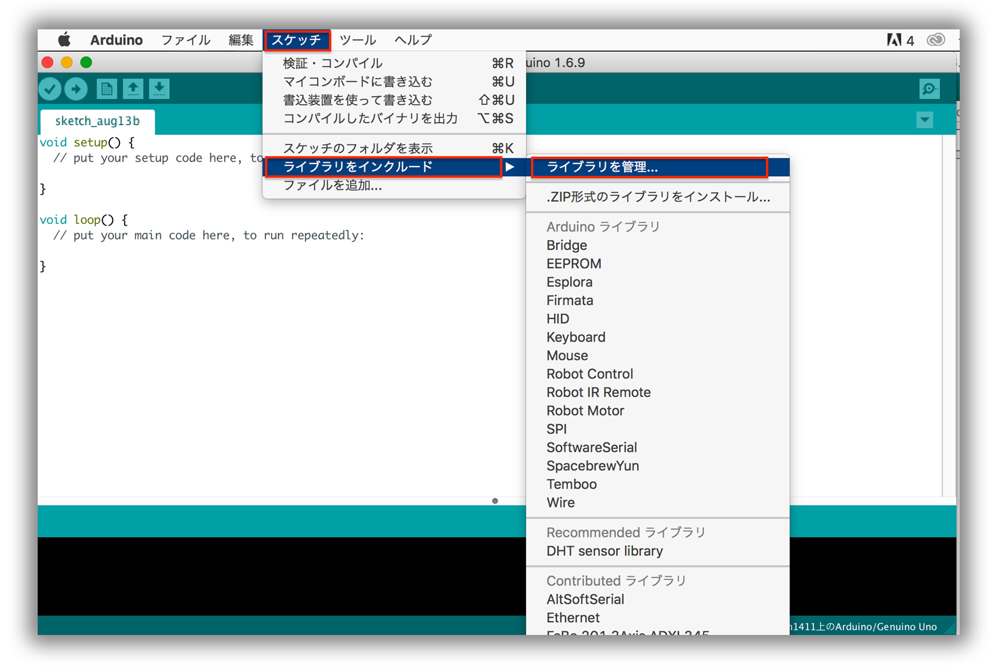

# #208 Humidity I2C Brick


<!--COLORME-->

## Overview
湿度センサを使用したBrickです。
I2Cでデータを取得できます。

## 接続
I2Cコネクタへ接続します。


## HTS221 Datasheet
| Document |
| -- |
| [HTS221 Datasheet](http://www2.st.com/content/ccc/resource/technical/document/datasheet/4d/9a/9c/ad/25/07/42/34/DM00116291.pdf/files/DM00116291.pdf/jcr:content/translations/en.DM00116291.pdf) |

## Register
| Slave Address |
| -- |
| 0x5F |

## 回路図


## Library





  ライブラリ名：「FaBo 208 Humidity HTS221」

- [Library GitHub](https://github.com/FaBoPlatform/FaBoHumidity-HTS221-Library)
- [Library Document](http://fabo.io/doxygen/FaBoHumidity-HTS221-Library/)

## ソースコード

上記のArduino Libraryをインストールし、スケッチの例から、「FaBo 208 Humidity HTS221」→「humidity」を選択してください。

```c
/*************************************************** 
 This is an Example for the FaBo Humidity I2C Brick.

  http://fabo.io/208.html

 author:FaBo<info@fabo.io>
 maintainer:Akira Sasaki<akira@fabo.io>

 Released under APACHE LICENSE, VERSION 2.0
  http://www.apache.org/licenses/
 ****************************************************/

#include <Wire.h>
#include <FaBoHumidity_HTS221.h>

FaBoHumidity_HTS221 faboHumidity;

void setup() {
  Serial.begin(9600);
  Serial.println("RESET");
  Serial.println();

  Serial.println("configuring device.");

  if (faboHumidity.begin()) {
    Serial.println("configured FaBo Humidity Brick");
  } else {
    Serial.println("device error");
    while(1);
  }
}

void loop() { 
  double temp = faboHumidity.getTemperature();
  double humidity = faboHumidity.getHumidity();

  Serial.print(temp);
  Serial.println(" C");
  Serial.print(humidity);
  Serial.println(" %");
  delay(1000);
}
```

## Parts
- STMicroelectronics HTS221

## GitHub
- https://github.com/FaBoPlatform/FaBo/tree/master/208_humidity
