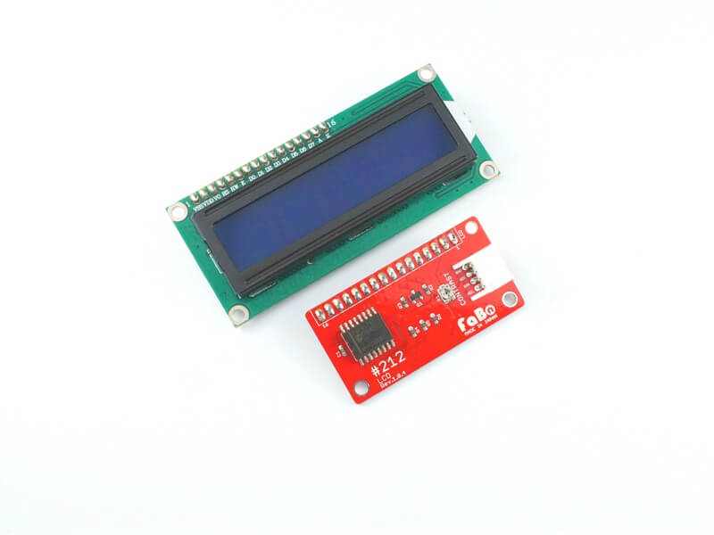
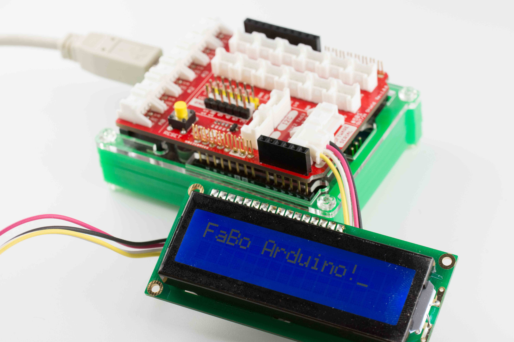
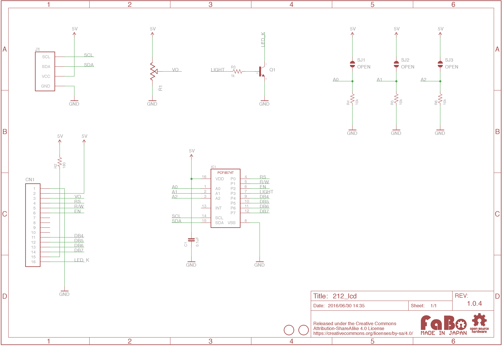
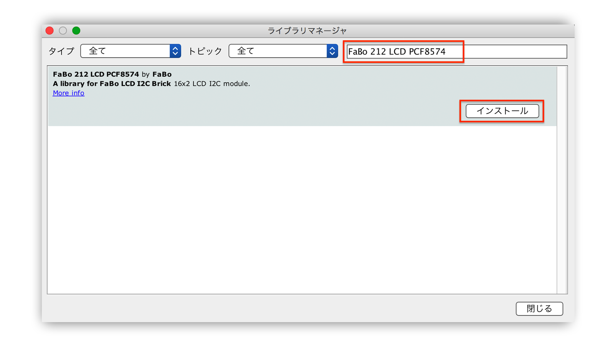

# #212 LCD I2C Brick


<!--COLORME-->

## Overview
LCDを使用したBrickです。

I2Cで表示データを制御できます。

## 接続
I2Cコネクタへ接続します。



## Support
|Arduino|RaspberryPI|
|:--:|:--:|
|◯|◯|

## PCF8574 Datasheet
| Document |
|:--|
| [PCF8574 Datasheet](http://www.tij.co.jp/jp/lit/ds/symlink/pcf8574.pdf) |

## Register
| A0 | A1 | A2 | Slave Address |
| -- | -- | -- | -- |
| LOW | LOW | LOW | 0x20 |

FaBo Brickでは、初期値に0x20が設定されています。Brick表面のソルダージャンパーで設定を変更できます。

## 回路図


## Library




  ライブラリ名：「FaBo 212 LCD PCF8574」

- [Library GitHub](https://github.com/FaBoPlatform/FaBoLCD-PCF8574-Library)
- [Library Document](http://fabo.io/doxygen/FaBoLCD-PCF8574-Library)

## ソースコード

Hello Worldを表示するサンプル.

```c
/*
  This is an Example for the FaBo LCD I2C Brick.

 Library originally added 18 Apr 2008
 by David A. Mellis
 library modified 5 Jul 2009
 by Limor Fried (http://www.ladyada.net)
 example added 9 Jul 2009
 by Tom Igoe
 modified 22 Nov 2010
 by Tom Igoe
 compatible library 23 Mar 2016
 by Hideki Yamauchi

 This example code is in the public domain.

 http://fabo.io/212.html
 */

// include the library code:
#include <Wire.h>
#include <FaBoLCD_PCF8574.h>

// initialize the library
FaBoLCD_PCF8574 lcd;

void setup() {
  // set up the LCD's number of columns and rows:
  lcd.begin(16, 2);
  // Print a message to the LCD.
  lcd.print("hello, world!");
}

void loop() {
  // Turn off the cursor:
  lcd.noCursor();
  delay(500);
  // Turn on the cursor:
  lcd.cursor();
  delay(500);
}
```

## Parts
- PCF8574
- LCD 1602A

## GitHub
- https://github.com/FaBoPlatform/FaBo/tree/master/212_lcd
