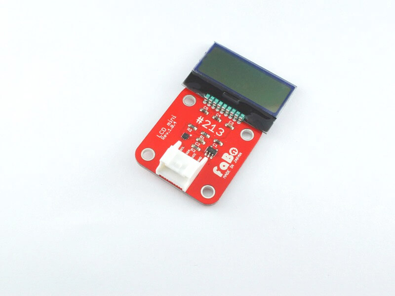
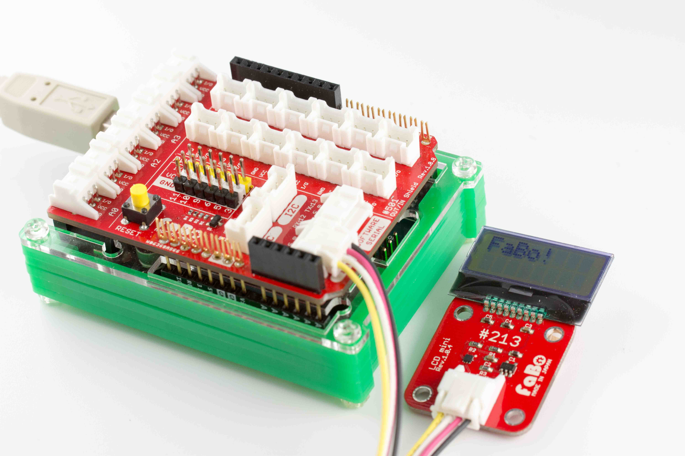
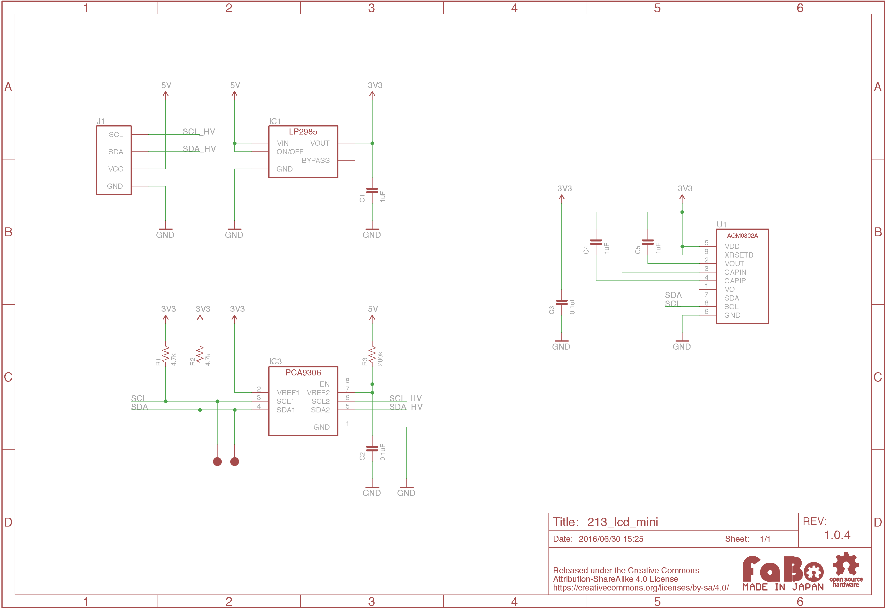
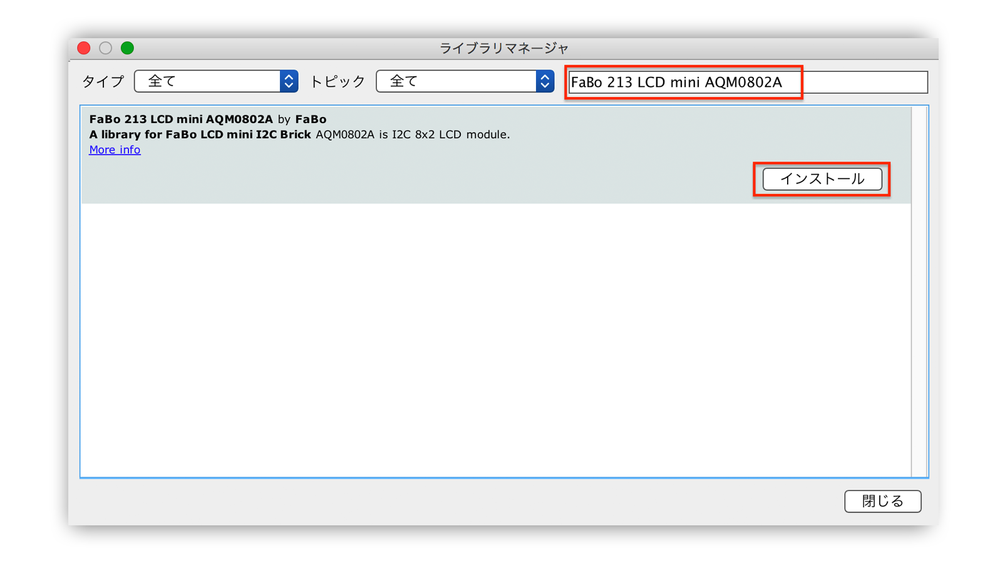

# #213 LCD mini I2C Brick


<!--COLORME-->

## Overview
8桁×2行の小さいLCDを使用したBrickです。

I2Cで表示データを制御できます。

## 接続
I2Cコネクタへ接続します。



## AQM0802A Datasheet
| Document |
| -- |
| [AQM0802A Datasheet](http://akizukidenshi.com/catalog/g/gP-06669/) |

## Register
| I2C Slave Address |
|:-- |
| 0x3E |

## 回路図


## Library




  ライブラリ名：「FaBo 213 LCD mini AQM0802A」

- [Library GitHub](https://github.com/FaBoPlatform/FaBoLCDmini-AQM0802A-Library)
- [Library Document](http://fabo.io/doxygen/FaBoLCDmini-AQM0802A-Library)

## ソースコード

上記のArduino Libraryをインストールし、スケッチの例、「FaBo 213 LCD mini AQM0802A」からお選びください。

下記は、Helloを表示するサンプルです。

```c
/*
  This is an Example for the FaBo LCD mini I2C Brick.

 LiquidCrystal Library originally added 18 Apr 2008
 by David A. Mellis
 library modified 5 Jul 2009
 by Limor Fried (http://www.ladyada.net)
 example added 9 Jul 2009
 by Tom Igoe
 modified 22 Nov 2010
 by Tom Igoe
 compatible library 2 Mar 2016
 by Hideki Yamauchi

 This example code is in the public domain.

 http://fabo.io/213.html
*/

// include the library code:
#include <Wire.h>
#include <FaBoLCDmini_AQM0802A.h>

// initialize the library
FaBoLCDmini_AQM0802A lcd;

void setup() {
  // set up the LCD:
  lcd.begin();
  // Print a message to the LCD.
  lcd.print("hello!");
}

void loop() {
  // set the cursor to column 0, line 1
  // (note: line 1 is the second row, since counting begins with 0):
  lcd.setCursor(0, 1);
  // print the number of seconds since reset:
  lcd.print(millis() / 1000);
}
```


## Parts
- AQM0802A

## GitHub
- https://github.com/FaBoPlatform/FaBoLCDmini-AQM0802A-Library
