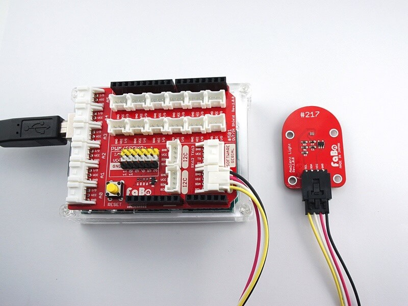
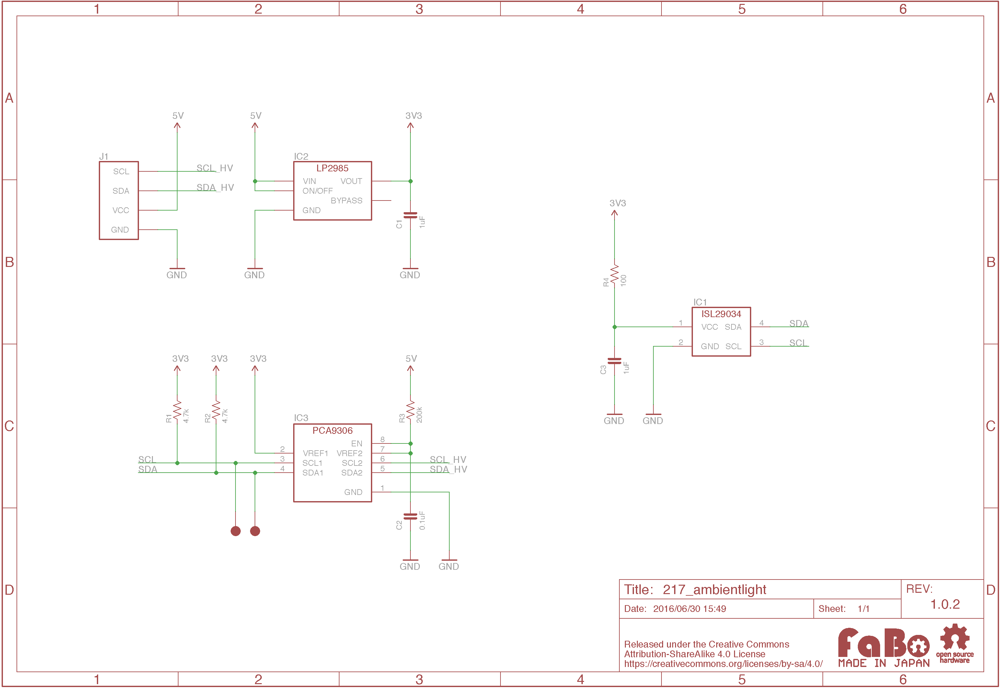
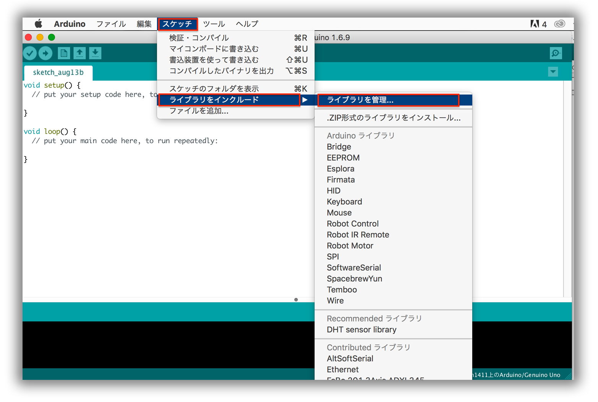
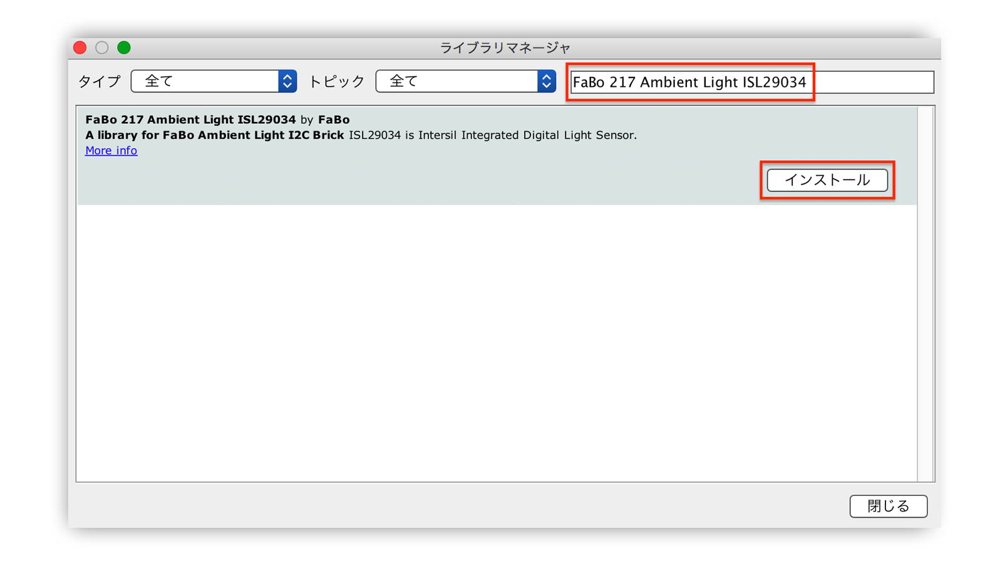

# #217 Ambient Light I2C Brick


<!--COLORME-->

## Overview
照度センサーを使ったBrickです。

I2Cで明るさを取得することができます。

## 接続
I2Cコネクタへ接続します。



## ISL29034 Datasheet
| Document |
| -- |
| [ISL29034 Datasheet](http://www.intersil.com/content/dam/Intersil/documents/isl2/isl29034.pdf) |

## Register
| Slave Address |
| -- |
| 0x44 |

## 回路図


## Library





  ライブラリ名：「FaBo 217 Ambient Light ISL29034」

- [Library GitHub](https://github.com/FaBoPlatform/FaBoAmbientLight-ISL29034-Library)
- [Library Document](http://fabo.io/doxygen/FaBoAmbientLight-ISL29034-Library/)

## ソースコード
上記のArduino Libraryをインストールし、スケッチの例、「FaBo 217 Ambient Light ISL29034」からお選びください。

```c
/**
 @file ambientlight.ino
 @brief This is an Example for the FaBo Ambient Light I2C Brick.

   http://fabo.io/217.html

   Released under APACHE LICENSE, VERSION 2.0

   http://www.apache.org/licenses/

 @author FaBo<info@fabo.io>
*/

#include <Wire.h>
#include <FaBoAmbientLight_ISL29034.h>

FaBoAmbientLight faboAmbientLight;

void setup() {
  Serial.begin(9600);
  Serial.println();
  Serial.println("RESET");
  Serial.println();
  Serial.println("configuring device.");

  if (faboAmbientLight.begin()) {
    Serial.println("configured FaBo Ambient Light Brick");
  } else {
    Serial.println("device error");
    while(1);
  }

}

void loop() {
  Serial.print("lux: ");
  Serial.println( faboAmbientLight.readLux(), 6 );
  delay(1000);
}
```

## Parts
- Intersil ISL29034

## GitHub
- https://github.com/FaBoPlatform/FaBo/tree/master/217_ambientlight
