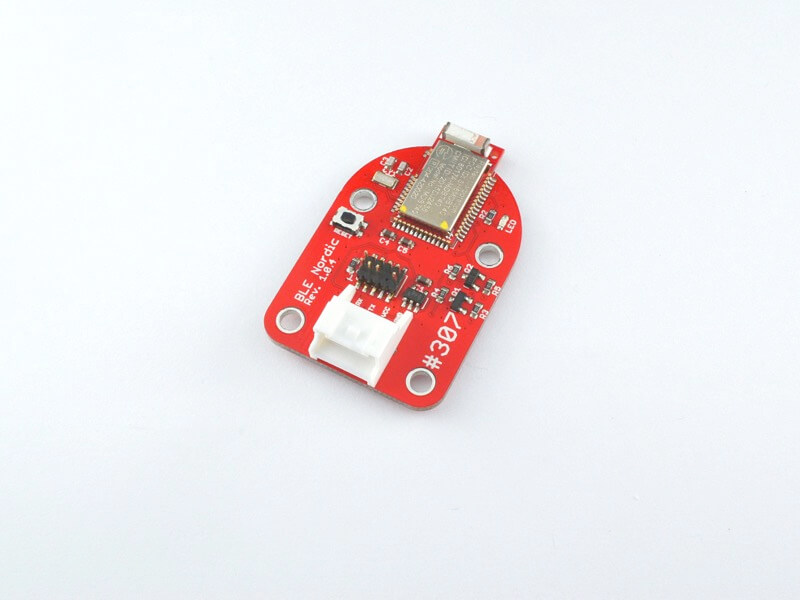
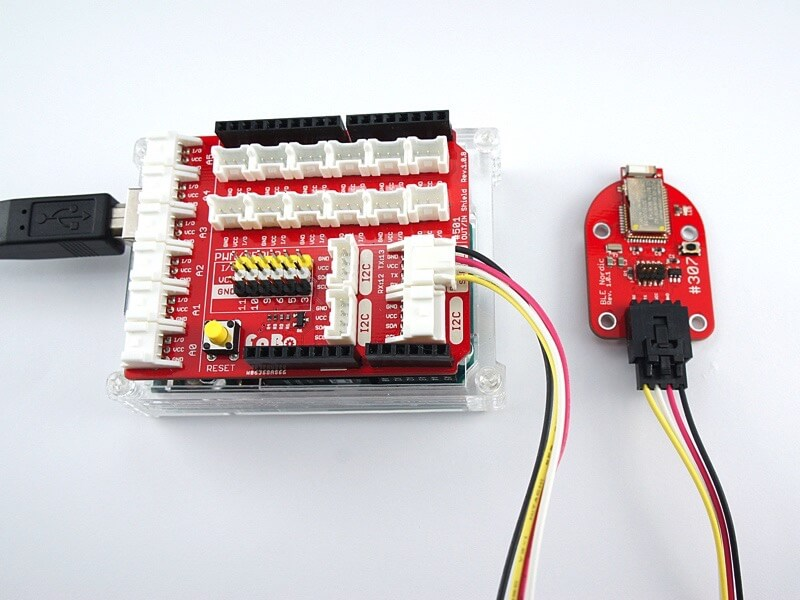
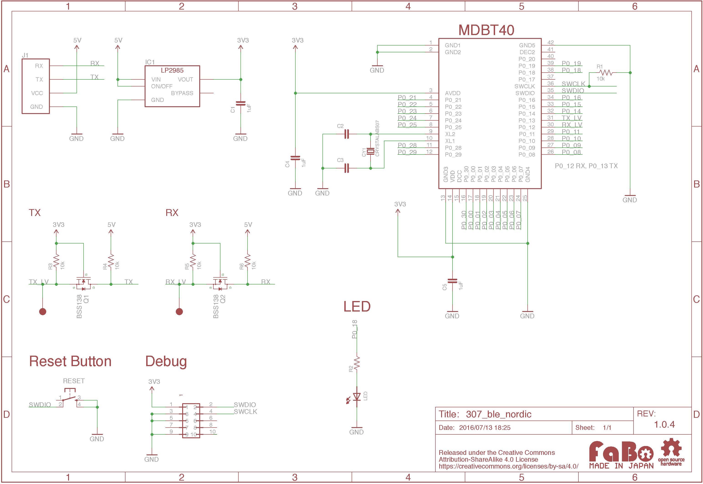

# #307 BLE Nordic Serial Brick

<center>

<!--COLORME-->

## Overview
NRF51モジュールを使用したBLE（Bluetooth Low Energy）のBrickです。

シリアルにて制御できるFirmwareが書き込まれているため、Arduino等からシリアル通信にてBLEを制御することができます。

BLEの転送レートは115200bpsに設定してあります。

## 接続
Serialコネクタへ接続します。




## MDBT40 Datasheet

|Document|
|--|
|[MDBT40 Datasheet](http://www.raytac.com/download/MDBT40/MDBT40%20spec-Version%20A4.pdf)|

## 回路図


## Library

### for Arduino
- [Arduino IDEからインストール](http://fabo.io/library_install.html)

  ライブラリ名：「FaBo 307 BLE Nordic」

- [Library GitHub](https://github.com/FaBoPlatform/FaBoBLE-Nordic-Library)
- [Library Document](http://fabo.io/doxygen/FaBoBLE-Nordic-Library/)

## ソースコード

上記のArduino Libraryをインストールし、スケッチの例、「FaBo 307 BLE Nordic」からお選びください。

Beacon発信
```c
//
// FaBo BLE Brick
//
// brick_serial_ble
//
#include <SoftwareSerial.h>
#include <fabo-nordic.h>

SoftwareSerial serial(12, 13);
FaboBLE faboBLE(serial);

// Beaconデータ作成
void makeBeaconData(byte *uuid, int16_t major, int16_t minor, int8_t pow) {
  byte data[30] = {0};
  byte header[] = {0x02, 0x01, 0x06, 0x1A, 0xFF, 0x4C, 0x00, 0x02, 0x15};
  memcpy(&data[0], &header[0], 9);
  memcpy(&data[9], uuid, 16);
  int16_t swapped_major = (major>>8) | (major<<8);
  memcpy(&data[25], &swapped_major, 2);
  int16_t swapped_minor = (minor>>8) | (minor<<8);
  memcpy(&data[27], &swapped_minor, 2);
  memcpy(&data[29], &pow, 1);
  // Advデータ設定
  faboBLE.setAdvData(data, 30);
}

// 初期化完了イベント
void onReady(FaboBLE::VersionInfo ver, int8_t error)
{
  Serial.println(F("\n*onReady"));
  Serial.print(F("CompanyID: "));
  Serial.println(ver.companyID, HEX);
  Serial.print(F("FirmwareID: "));
  Serial.println(ver.firmwareID, HEX);
  Serial.print(F("LMPVersion: "));
  Serial.println(ver.lmp);
  Serial.print(F("Error: "));
  Serial.println(error, HEX);
  // Beaconデータ作成
  byte uuid[] = {0x00, 0x01, 0x02, 0x03, 0x04, 0x05, 0x06, 0x07, 0x08, 0x09, 0x0a, 0x0b, 0x0c, 0x0d, 0x0e, 0x0f};
  makeBeaconData(uuid, 100, 1000, 0xC9);
}

// Advデータ設定イベント
void onSetAdvData(int8_t error)
{
  Serial.println(F("\n*onSetAdvData"));
  Serial.print(F("Error: "));
  Serial.println(error, HEX);
  // アドバタイズ開始
  faboBLE.startAdvertise();
}

void setup()
{
  Serial.begin(9600);

  // Debugモードでログが詳細に表示されます
  faboBLE.setDebug();
  // イベントハンドラ登録
  faboBLE.onReady = onReady;
  faboBLE.onSetAdvData = onSetAdvData;
  // 初期化
  faboBLE.init();
}

void loop()
{
  // BLE内部処理のためloop内で呼び出してください
  faboBLE.tick();
}
```

GATT
```c
//
// FaBo BLE Brick
//
#include <SoftwareSerial.h>
#include <fabo-nordic.h>

SoftwareSerial serial(12, 13);
FaboBLE faboBLE(serial);

// 初期化完了イベント
void onReady(FaboBLE::VersionInfo ver, int8_t error)
{
  Serial.println(F("\n*onReady"));
  Serial.print(F("CompanyID: "));
  Serial.println(ver.companyID, HEX);
  Serial.print(F("FirmwareID: "));
  Serial.println(ver.firmwareID, HEX);
  Serial.print(F("LMPVersion: "));
  Serial.println(ver.lmp);
  Serial.print(F("Error: "));
  Serial.println(error, HEX);
  // Service追加
  faboBLE.addService(0x1234);
}

// Service追加イベント
void onServiceAdded(uint16_t handle, uint8_t error)
{
  Serial.println(F("\n*onServiceAdded"));
  Serial.print(F("Handle: "));
  Serial.println(handle, HEX);
  Serial.print(F("Error: "));
  Serial.println(error, HEX);
  // Characteristic追加
    byte data[] = {0x11, 0x22};
  faboBLE.addCharacteristic(handle, data, 2, 0x5678);
}

// Characteristic追加イベント
void onCharacteristicAdded(uint16_t handle, uint8_t error)
{
  Serial.println(F("\n*onCharacteristicAdded"));
  Serial.print(F("Handle: "));
  Serial.println(handle, HEX);
  Serial.print(F("Error: "));
  Serial.println(error, HEX);
  // アドバタイズ開始
  faboBLE.startAdvertise();
}

// 書き込みイベント
void onWrite(byte *data, uint8_t len)
{
  Debug.println(F("\n*onWrite"));
  Serial.print(F("Len: "));
  Debug.println(len, DEC);
  Serial.print(F("Data: "));
  for (int i=0; i<len; i++) {
    Debug.print(data[i], HEX);
    Debug.print(F(" "));
  }
  Debug.println(F(""));
}
// 接続された時に呼ばれる
void onConnected(uint16_t handle)
{
  Serial.println("\n*onConnected");
  Serial.print("handle:");
  Serial.println(handle, HEX);
}

// 接続が切れた時に呼ばれる
void onDisconnected(uint16_t handle, uint8_t reason)
{
  Serial.println("\n*onDisconnected");
  Serial.print("handle:");
  Serial.println(handle, HEX);
  Serial.print("reason:");
  Serial.println(reason, HEX);
  // アドバタイズ開始
  faboBLE.startAdvertise();
}

void setup()
{
  Serial.begin(9600);

  // Debugモードでログが詳細に表示されます
  faboBLE.setDebug();
  // イベントハンドラ登録
  faboBLE.onReady = onReady;
  faboBLE.onWrite = onWrite;
  faboBLE.onServiceAdded = onServiceAdded;
  faboBLE.onCharacteristicAdded = onCharacteristicAdded;
  faboBLE.onConnected = onConnected;
  faboBLE.onDisconnected = onDisconnected;
  // UUIDとデバイス名を指定して初期化
  uint8_t uuid[] = {
    0x01, 0x02, 0x03, 0x04, 0x05, 0x06, 0x07, 0x08,
    0x09, 0x0a, 0x0b, 0x0c, 0x00, 0x00, 0x0f, 0x10,
  };
  faboBLE.init("myBLE", uuid);
}

void loop()
{
  // BLE内部処理のためloop内で呼び出してください
  faboBLE.tick();
}
```

SCAN
```c
//
// FaBo BLE Brick
//
// brick_serial_ble
//
#include <SoftwareSerial.h>
#include <fabo-nordic.h>

SoftwareSerial serial(12, 13);
FaboBLE faboBLE(serial);

// 初期化完了イベント
void onReady(FaboBLE::VersionInfo ver, int8_t error)
{
  Serial.println(F("\n*onReady"));
  Serial.print(F("CompanyID: "));
  Serial.println(ver.companyID, HEX);
  Serial.print(F("FirmwareID: "));
  Serial.println(ver.firmwareID, HEX);
  Serial.print(F("LMPVersion: "));
  Serial.println(ver.lmp);
  Serial.print(F("Error: "));
  Serial.println(error, HEX);
  // Scan開始
  faboBLE.scan();
}

// Scan時のイベントハンドラ
void onScanned(FaboBLE::ScanData &data)
{
  Serial.println(F("\n*BLE_GAP_EVT_ADV_REPORT"));
  Serial.print(F("Connection Handle:"));
  Serial.println(data.handle, HEX);
  Serial.print(F("Address Type:"));
  Serial.println(data.addressType, HEX);
  Serial.print(F("Address:"));
  for (int i=0; i<6; i++) {
    Serial.print(data.address[i], HEX);
    Serial.print(F(" "));
  }
  Serial.print(F("\nRSSI:"));
  Serial.println(data.RSSI, DEC);
  Serial.print(F("Flags:"));
  Serial.println(data.flags, HEX);
  Serial.print(F("DataLen:"));
  Serial.println(data.dataLen, DEC);
  Serial.print(F("Data:"));
  for (int i=0; i<data.dataLen; i++) {
    Serial.print(data.data[i], HEX);
    Serial.print(F(" "));
  }
  Serial.print(F("\n"));
}

void setup()
{
  Serial.begin(9600);

  // Debugモードでログが詳細に表示されます
  //faboBLE.setDebug();
  // イベントハンドラ登録
  faboBLE.onReady = onReady;
  faboBLE.onScanned = onScanned;
  // 初期化
  faboBLE.init();
}

void loop()
{
  // BLE内部処理のためloop内で呼び出してください
  faboBLE.tick();
}
```


## Parts
- raytac MDBT40

## GitHub
- https://github.com/FaBoPlatform/FaBo/tree/master/307_ble_nordic
