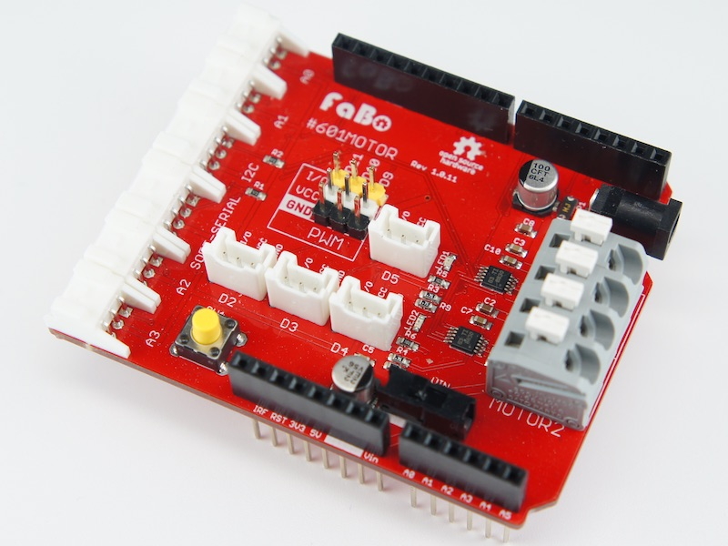

# #601 Motor Shield for Arduino


<!--COLORME-->

## Overview
DCモーター、およびサーボモーターを制御するシールドです。
モーターの他に、Analog、I2C、シリアルの各Brickを使用することができます。

なお、モーターを使用する場合、外部電源が必要になります。

## コネクタ

### DCモータ用コネクタ
- Moter1用コネクタ
- Moter2用コネクタ
- 外部電源

### アナログコネクタ
- A0
- A1
- A2
- A3

### デジタルコネクタ
- D2
- D3
- D4
- D5

### PWM/Servoコネクタ
- D9
- D10
- D11

### シリアルコネクタ
SoftwareSerialとして使用するため、RX,TXはそれぞれ、D12,D13になります

### I2Cコネクタ
- SCL, SDA

### DRV8830 Datasheet
| Document |
| -- |
| [DRV8830](http://www.tij.co.jp/jp/lit/ds/symlink/drv8830.pdf)|

### Slave Address
| DCモーター | スレーブアドレス |
| -- | -- |
| MOTOR1 | 0x64 |
| MOTOR2 | 0x63 |

## 動作方法について
### 制御について
DCモーターはI2C、サーボモーターはPWMにて制御を行います。

Moterに対応したスレーブアドレスの制御用レジスタに、速度と動作を設定することで接続されたDCモーターが動作します。

### VINピンについて
VINピンの使用状況によってVINスイッチのON/OFFを切り替えて使用して下さい。

### エラー発生時について
モーターシールドではエラー発生時にLEDが点灯します。
主な原因として電力不足が考えられます。

### for Arduino
・DCモーター用サンプルコード
```c
// I2C制御で使用するライブラリ
#include <Wire.h>

// I2Cアドレス
#define ADR_DRV      0x64  // MOTOR1(DRV8830)のスレーブアドレス
#define ADR_CTR      0x00  // CONTROLレジスタのアドレス

// 速度設定 (電圧)
#define SPEED_MAX    0x3F  // 最速 0x3F : 5.00V
#define SPEED_MIN    0x09  // 最遅 0x06 : 0.48V

// モーター制御 (ブリッジ制御)
#define MODE_STANBY  B00   // スタンバイ(未制御)   
#define MODE_REVERSE B01   // 逆転
#define MODE_FORWARD B10   // 正転
#define MODE_BRAKE   B11   // ブレーキ(停止)

/* 
 * モーター制御コマンド 
 *  mode : 動作モード
 *  sp   : 速度
 */
int set_motor(byte mode, byte sp) {
  // モータードライバのアドレス
  Wire.beginTransmission(ADR_DRV);
  // 制御用レジスタ(ADR_CTR)の書き込み
  Wire.write(ADR_CTR);
  // 動作の設定
  Wire.write( mode + (sp<<2) );
  // 書き込み終了
  return Wire.endTransmission();
}

/* 
 * 初期処理
 */
void setup() {
  // I2Cの開始
  Wire.begin();
  // シリアル開始 転送レート：9600bps
  Serial.begin(9600);
  // スタンバイモード
  Serial.println("Standby");
  set_motor(MODE_STANBY, SPEED_MIN);
  delay(2000);
 }

/*
 * Loop処理
 * 前進>停止>後退>停止のループ
 */ 
void loop() {

  // 正転モード
  Serial.println("Forward");
  set_motor(MODE_FORWARD, SPEED_MAX);
  delay(2000);

  // ブレーキモード
  Serial.println("Brake");
  set_motor(MODE_BRAKE, SPEED_MIN);
  delay(2000);

  // 逆転モード
  Serial.println("Reverse");
  set_motor(MODE_REVERSE, SPEED_MAX);
  delay(2000);

  // ブレーキモード
  Serial.println("Brake");
  set_motor(MODE_BRAKE, SPEED_MIN);
  delay(2000);
}
```

・サーボモーター用サンプルコード
```c
// サーボモーター用ライブラリ
#include <Servo.h>

// サーボモーター用ピン
#define PIN_SERVO  9  

// サーボモーター位置設定用
int angle = 0;

// サーボ制御用オブジェクト作成
Servo myServo;

/* 
 * 初期処理
 */
void setup() {
  // シリアル開始
  Serial.begin(9600);

  // サーボ制御開始
  myServo.attach(PIN_SERVO);
}

/*
 * Loop処理
 */ 
 void loop() {

  /* 0.01秒間隔で1ずつ移動し、180を超えたら最初の位置に移動 */
  for (int i=0; i<5; i++){
    for (angle=0; angle<180; angle++){
      myServo.write(angle);
      delay(10);
    }
  }
  delay(1000);
  
  /* 1秒間隔で左右に振る */
  //初期値設定
  angle = 10;
  
  for (int i=0; i<5; i++){
    myServo.write(angle);
    delay(1000);
    // 位置切り替え
    angle = 180 - angle;
  }
  delay(1000); 
}
```
